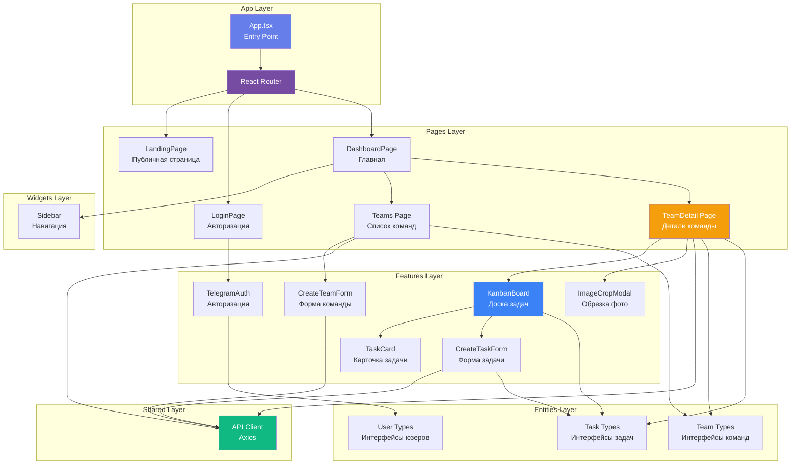

# Coopera Frontend - Статус проекта

## 📋 Описание

Coopera - это веб-приложение для управления командами и задачами с элементами геймификации. Проект построен на React + TypeScript с использованием архитектуры Feature-Sliced Design (FSD).

## 🏗️ Архитектура

Проект следует методологии **Feature-Sliced Design (FSD)**.

### Диаграмма компонентов



### Структура папок

```
src/
├── app/          # Конфигурация приложения (App.tsx, роутинг, глобальные стили)
├── pages/        # Страницы приложения
│   ├── dashboard/    # Главная страница с обзором
│   ├── teams/        # Список команд пользователя
│   ├── team-detail/  # Детальная страница команды с канбаном
│   ├── login/        # Страница входа
│   └── landing/      # Лендинг для новых пользователей
├── widgets/      # Комплексные UI компоненты
│   └── sidebar/      # Боковое меню навигации
├── features/     # Бизнес-фичи приложения
│   ├── auth-by-telegram/  # Авторизация через Telegram
│   ├── task/              # Управление задачами (канбан, формы)
│   └── team/              # Управление командами (создание, редактирование)
├── entities/     # Бизнес-сущности
│   ├── team/     # Типы и модели команд
│   ├── task/     # Типы и модели задач
│   ├── user/     # Типы пользователей
│   └── column/   # Типы колонок канбана
└── shared/       # Переиспользуемый код
    └── api/      # HTTP клиент для работы с backend

```

## ✅ Что реализовано

### Backend интеграция
- ✅ **API Client** - Axios-based клиент с базовой конфигурацией
- ✅ **Teams API** - `GET /teams/`, `POST /teams/`, `DELETE /teams/`
- ✅ **Tasks API** - `POST /tasks/`, `PUT /tasks/?task_id=`
- ✅ **Memberships API** - `POST /memberships/`, `DELETE /memberships/`
- ✅ **Users API** - `GET /users/`, `POST /users/`
- ✅ Трансформация данных (PascalCase из бэкенда → camelCase для фронта)
- ✅ Обработка ошибок с `console.error` для критичных случаев

### Управление командами
- ✅ Отображение сетки команд с современным дизайном карточек
- ✅ Создание команды через модальную форму
- ✅ Удаление команды с подтверждением
- ✅ Градиентная иконка команды (фиолетовый градиент)
- ✅ Отображение количества участников и даты создания
- ✅ Кликабельные карточки для перехода к команде
- ✅ Prominent кнопка удаления (красная с иконкой корзины)

### Детальная страница команды
- ✅ **Баннер команды** - 150px высота с возможностью загрузки обложки
- ✅ **Обрезка изображений** - react-easy-crop с соотношением 16:4, zoom 1-3x
- ✅ **Inline редактирование** - название и описание команды с кнопками сохранить/отменить
- ✅ Кнопка "Назад к командам"
- ✅ Интеграция с backend для сохранения изменений

### Канбан-доска
- ✅ **Drag-and-drop** - @dnd-kit для перетаскивания задач
- ✅ **4 колонки** - To Do, In Progress, Review, Done
- ✅ Sortable задачи внутри колонок
- ✅ Визуальный feedback при перетаскивании (DragOverlay)
- ✅ Обновление статуса задачи на backend при drop
- ✅ Keyboard accessibility для drag-and-drop
- ✅ Плавные анимации и переходы

### Управление задачами
- ✅ Создание задачи через модальную форму
- ✅ Поля: название, описание, баллы, исполнитель
- ✅ Интеграция с backend (`POST /tasks/`)
- ✅ Обновление статуса через drag-and-drop (`PUT /tasks/`)
- ✅ Отображение карточки задачи с баллами и исполнителем
- ✅ Упрощенная форма (убраны приоритет и срок выполнения)

### UI/UX
- ✅ **Шрифт Montserrat** - глобально применен (weights 300-800)
- ✅ **Фиолетовый градиент** - #667eea → #764ba2 как основная тема
- ✅ Современные карточки с hover-эффектами
- ✅ Адаптивный дизайн
- ✅ Loading states и обработка ошибок
- ✅ Empty states с call-to-action

### Роутинг
- ✅ React Router v7 с nested routes
- ✅ `/` - Landing page
- ✅ `/login` - Страница входа
- ✅ `/dashboard` - Главная страница (обзор)
- ✅ `/dashboard/teams` - Список команд
- ✅ `/dashboard/teams/:teamId` - Детали команды с канбаном
- ✅ `/dashboard/settings` - Настройки (placeholder)
- ✅ Sidebar всегда видим на всех dashboard маршрутах

## 🔮 Планы на будущее

### Критичные
- 🔲 **Реальная аутентификация** - заменить hardcoded `user_id: 1` на настоящую авторизацию
- 🔲 **GET /tasks/?team_id=** - реализовать на бэкенде и раскомментировать useEffect в team-detail.tsx
- 🔲 **PUT /teams/?team_id=** - endpoint для сохранения названия и описания команды
- 🔲 **Cover image persistence** - сохранение обложки команды на бэкенд

### Функционал команд
- 🔲 Управление участниками (invite, remove, change roles)
- 🔲 Редактирование команды (отдельная страница или расширенная форма)
- 🔲 Поиск и фильтрация команд
- 🔲 Пагинация для больших списков команд
- 🔲 Сортировка команд (по названию, дате, количеству участников)
- 🔲 Система приглашений в команду

### Функционал задач
- 🔲 Назначение задач участникам команды
- 🔲 Комментарии к задачам
- 🔲 Activity log (история изменений)
- 🔲 Фильтрация задач (по исполнителю, тегам)
- 🔲 Поиск задач
- 🔲 Quick edit (inline редактирование задачи)
- 🔲 Drag-and-drop назначение исполнителя

### Канбан-доска
- 🔲 Кастомизация колонок (добавление, удаление, переименование)
- 🔲 Swimlanes (группировка по исполнителю, приоритету)
- 🔲 Collapse/expand колонок
- 🔲 Подсчет и отображение WIP limits

### Геймификация
- 🔲 Система начисления баллов за выполнение задач
- 🔲 Лидерборд участников команды
- 🔲 Достижения и бейджи
- 🔲 Уровни пользователей

### Производительность и качество
- 🔲 Request/response logging только для dev mode
- 🔲 Request retry logic для failed requests
- 🔲 Request caching для GET endpoints
- 🔲 Type-safe error handling с custom error classes
- 🔲 Оптимистичные UI обновления для всех операций
- 🔲 WebSockets для real-time коллаборации

### UI улучшения
- 🔲 Dark mode
- 🔲 Настройка тем
- 🔲 Анимации переходов между страницами
- 🔲 Skeleton loaders вместо простых loading states
- 🔲 Toast notifications для успешных операций
- 🔲 Подтверждающие диалоги для критичных действий

## 🛠️ Технологический стек

### Core
- **React 19.2.0** - UI библиотека
- **TypeScript** - статическая типизация
- **Vite** - build tool и dev server (порт 3000)
- **React Router 7.9.6** - routing

### UI & UX
- **@dnd-kit 6.1.0** - drag-and-drop функционал
- **react-easy-crop 5.5.5** - обрезка изображений
- **Montserrat** - основной шрифт (Google Fonts)

### State & Data
- **Axios 1.13.2** - HTTP клиент
- **Zustand 5.0.8** - state management для auth

### Backend
- **Go + chi router** - REST API на `localhost:8080/api/v1`
- **PostgreSQL** - база данных (предположительно)

## 📝 Важные заметки

### Backend API особенности
- Backend использует **PascalCase** для полей (ID, Name, CreatedAt)
- Frontend трансформирует в **camelCase** (id, name, createdAt)
- Все изменяющие запросы требуют `current_user_id` для валидации прав
- DELETE /teams/ требует `current_user_id` с ролью Manager

### Текущие ограничения
- **Hardcoded user_id: 1** - используется везде, где нужна аутентификация
- **GET /teams/** без параметров возвращает ошибку - backend ожидает team_id
- **GET /tasks/** endpoint еще не реализован на бэкенде (закомментирован useEffect)
- **Обложка команды** не сохраняется - только локально в state

### Code style
- Все `console.log` удалены из production кода
- Оставлены только `console.error` для критичных ошибок
- Используются JSDoc комментарии для документации модулей
- TODO заменены на FUTURE с четкими описаниями

## 📂 Ключевые файлы

### API & Data
- `src/shared/api/client.ts` - HTTP клиент с методами для всех endpoints
- `src/entities/team/types.ts` - типы команд, проектов, участников
- `src/entities/task/types.ts` - типы задач

### Pages
- `src/pages/teams/ui/teams.tsx` - список команд
- `src/pages/team-detail/ui/team-detail.tsx` - детали команды + канбан
- `src/pages/dashboard/ui/dashboard-page.tsx` - главная с роутингом

### Features
- `src/features/task/ui/kanban-board/kanban-board.tsx` - drag-and-drop канбан
- `src/features/task/ui/create-task-form/create-task-form.tsx` - форма создания задачи
- `src/features/team/create-team-form.tsx` - форма создания команды
- `src/features/team/image-crop-modal.tsx` - модалка обрезки изображения
- `src/features/auth-by-telegram/` - Telegram авторизация (для будущего)

### Widgets
- `src/widgets/sidebar/ui/sidebar.tsx` - боковое меню навигации

### Configuration
- `vite.config.ts` - Vite конфиг с алиасом `@` → `./src`
- `tsconfig.json` - TypeScript конфиг с path mapping
- `eslint.config.js` - ESLint с правилами для FSD архитектуры

## 🚀 Запуск проекта

```bash
# Установка зависимостей
npm install

# Запуск dev сервера (localhost:3000)
npm run dev

# Build для production
npm run build

# Preview production build
npm run preview
```

## 📦 Основные зависимости

```json
{
  "@dnd-kit/core": "^6.3.1",
  "@dnd-kit/sortable": "^10.0.0",
  "@dnd-kit/utilities": "^3.2.2",
  "axios": "^1.13.2",
  "react": "^19.2.0",
  "react-dom": "^19.2.0",
  "react-easy-crop": "^5.5.5",
  "react-router-dom": "^7.9.6",
  "zustand": "^5.0.8"
}
```

## 🎨 Дизайн система

### Цвета
- **Primary gradient**: `linear-gradient(135deg, #667eea 0%, #764ba2 100%)`
- **Background**: `#f9fafb`, `#ffffff`
- **Text**: `#1f2937` (темный), `#6b7280` (вторичный), `#9ca3af` (tertiary)
- **Success**: `#10b981`
- **Error**: `#ef4444`

### Типографика
- **Font**: Montserrat (300, 400, 500, 600, 700, 800)
- **H1**: 2.25rem (36px)
- **Body**: 1rem (16px)
- **Small**: 0.875rem (14px)

### Spacing
- **Border radius**: 8px (small), 12px (medium), 16px (large)
- **Padding**: 0.5rem (8px), 1rem (16px), 1.5rem (24px), 2rem (32px)
- **Gap**: 0.5rem, 1rem, 1.5rem, 2rem

### Shadows
- **Small**: `0 2px 8px rgba(0, 0, 0, 0.08)`
- **Medium**: `0 4px 12px rgba(0, 0, 0, 0.1)`
- **Large**: `0 12px 28px rgba(102, 126, 234, 0.25)`

---

**Дата последнего обновления:** 24 ноября 2025  
**Версия:** 0.1.0 (MVP)  
**Автор:** flavvvour